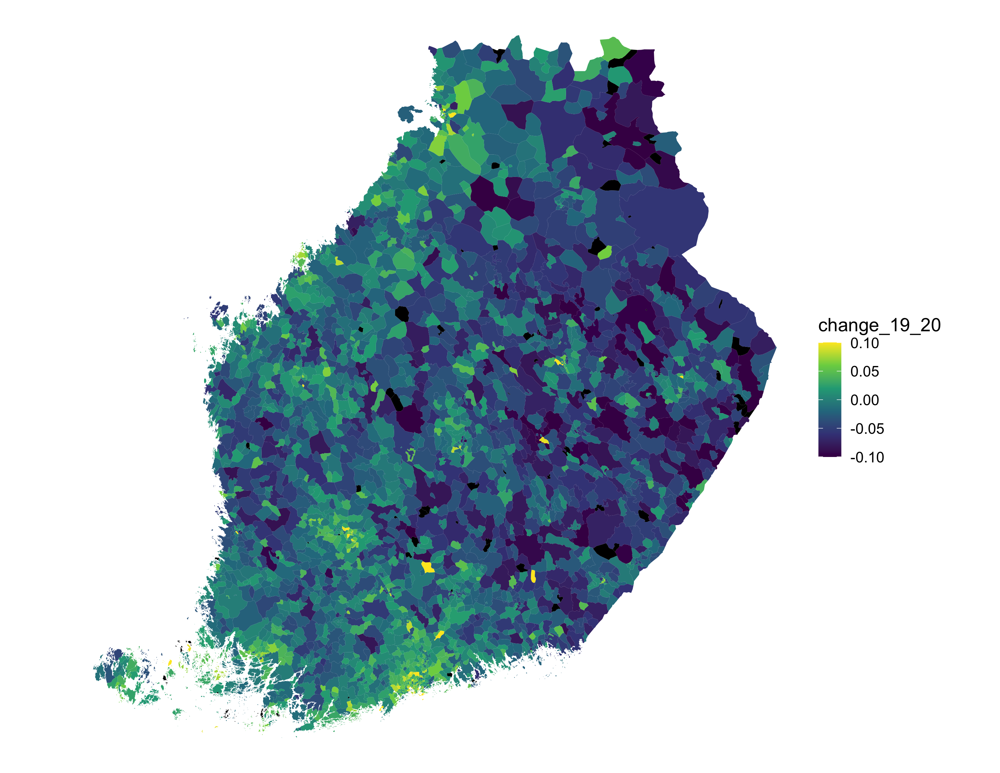

# Here we go again, although this is not the final title

Some years ago, we needed apartment price estimates for areas for which such are not provided, due to too small population or too few transactions. We ended up creating a model based on the hierarchy of zip codes and making a public demonstration out of it --- Kannattaako Kauppa. Although the associated quadratic temporal model served well in its purpose years ago, its limits have become apparent, and the pandemic with its new anomalies now finally pushed us to update not only data but the model as well.

The original model is detailed in a [blog post](http://ropengov.org/2015/06/a-hierarchical-model-of-finnish-apartment-prices/), and we see two main drawbacks in it. First, spatial smoothness, or generalizing of evidence spatially, is based almost entirely on the zip hierarchy (the exception being population density). Alternatives would be explicit spatial adjacencies, which way we didn't go yet, and the known demographics of the areas, which are now in the model. Then there is the quadratic temporal form. That was justifiable six years ago and is still to a degree --- but now, something that takes the peculiarities of single years into account is more interesting and better fits the data.

## Demographics help with sparse observations

In the new model, predictive power mainly becomes from *demographic covariates*, 23 variables selected from the open data that describe the geographical extent, people, households, apartments, and professions of the zip code areas. The covariates have yearly coefficients in the model, so the model has gained temporal flexibility compared to the original. Zip-code prefix hierarchy is still there, but with the quadratic term dropped. This allows the local price levels and trends to deviate from the predictions of covariates.

What use is "predictive power" for past prices? When one has only a few transactions, price level and especially trend are mostly unknown. By accident, those few sales may be on the high or low side of the scale. Many "top performers" on ranking lists turn out to be statistical flukes. So a good model, if nothing else, shows the uncertainty. But a good model also generalizes over similar or nearby regions, and over time. So the model can partially fill holes and uncertainties in the data, to the degree continuities in real prices support it. And we know that there is temporal, spatial and demographic regularity in the real world.

Looking at slots of combined year and zip code, around 90% of all reported transactions are in about 18% of the slots. Meanwhile, some 31k or 93% of the slots have less than one hundred transactions, and 73% have less than ten. Not that many postal areas have no apartments either! But even on areas with apartments, data is sparse, and modelling is needed to fill the holes.

As an additional benefit of having demographics in the model, we see how they affect prices over time. Covariate coefficients provide us interesting insights into the effects of the pandemic, but before taking a closer look at those, let's dive into some details of the model.

## The core model

As said, we use demographic data from Statistics Finland. The whole Paavo database contains some 100-odd entries per postal code area, with information about population, households, employment, jobs, properties and so forth. Based on a nonparametric model, we picked a bit over 20 of the most relevant ones of those to keep the amount of parameters at bay and the results interpretable. Then, we normalised the figures with relevant counts, e.g. number of service jobs by total number of jobs in an area, etc., and used logit transformation to get good covariates. Finally, the covariates were standardized.

The open data provided by Statistics Finland is a rare treasure, accurate demographic data with such level of granularity. However, due to understandable privacy reasons, data from postal areas with too few people is censored. And as you might know, Finland is sparsely populated meaning the amount of censored entries is non-negligible. As one of the key purposes of the model is to estimate property prices in areas where they are not known, we cannot simply drop censored data points but need to impute them. For that, we use state-of-art multiple-imputation package [Amelia II](https://gking.harvard.edu/amelia), which could be a topic for another blog post. Here, let's just say using it is far better than imputing with zeros or mean values. (In future, missingness could be included in the core model.)

Another challenge in the demographic data is its snapshot quality: the information is from years 2018 and 2019. We know it is dubious to use demographics from one year to predict the prices of past or following years. Then again, complete temporal covariate data is available neither as time series nor as yearly snapshots. Assuming demographics change a lot slower than apartment prices, we just have to be careful with interpretations, especially causal ones. For predictions, using a snapshot of demography is obviously better than not using demographics at all.

### When in doubt, trust the empiria

Varying numbers of transactions per zip $\times$ year slots offer a subtle choice for reporting.

Especially in city centers, one sometimes has hundreds of transactions per slot. The mean price for the slot is then known quite well: In Etelä-Haaga of Helsinki, with postal code 00320, there were 386 apartments sold in 2019, with the log-price 8.54. We don't know the population variance (without modeling), but we can trust on relative accuracy of the mean: 386 sales, who can argue with that?

If that happened to be an anomalous year in Etelä-Haaga, for example due to a large construction work or other transient effect, the model has no way to predict the anomaly. So there is variation unique to the slots that the model doesn't catch, and sometimes we see it when transactions are plenty. When transactions are few or absent, then we have to rely on the model, including its uncertainty.

In cases we know the "emprical truth" like in Etelä-Haaga, what should we communicate? One can either communicate the price level and trend from the model, and say: "Well, you know, these models are imperfect and we have the error term there for that. It even takes into account the varying number of transactions." (As it does.) The alternative is to make a compromise: "All right, in this particular slot the evidence is so strong that the model need to have less weight, if at all."

On earlier iterations we have communicated the smooth trends from the model. This time we decided to try the compromise. But how to make it? We just need to redraw the border between modeled expectation and error.

In the original model, our error variance already has two parts, one independent of number of transactions $n$, and one that scales with $1/n$, thereby assuming independent transactions within a slot. In the new model, we take the first part away from error variance and place it into the model as a slot-specific random effect (details below).

As a result, the prices you see on the site are now more into reality where good evidence is available.

### Formal parts

The essential parts of the model are
$$
\begin{aligned}
h_{it} &= x_i^T \beta_t + \sum_l \left( a_{li} t + b_{li} \right) + u_{it} + \epsilon_{it}\;,\\
u_{it} &\sim N\!\left(0  , \sigma^u_t \right)\;,\\
\epsilon_{it} &\sim t\! \left(0,\, \frac{ \sigma^\epsilon } { \sqrt{n_{it}} },\, \nu \right)\;.
\end{aligned}
$$

Of indices, $i$ refers to the postal code and $t$ is the year. Then $h$ are the observed log-price, $x$ are covariates, $\beta$ are (yearly) covariate coefficients. The sum is the "pseudospatial" random effect built on the postal-code prefix hierarchy, with prefix levels $l$, and varying trends $a$ and intercepts $b$. This relatively rigid structure is loosened by the $i \times t$ -level random effect $u$. Model terms up to this point are supposed to represent underlying real prices. Note that the last term has yearly spread $\sigma^u_{t}$, allowing some years to be more deviant than others.

Finally, finite numbers of observed transactions $n$ cause "measurement error" $\epsilon$. Assuming indepedent transactions, the variance of this error scales with $1/n$, but we have left space for outliers by using a Student-t distribution with its degrees of freedom $\nu$ parametrized to the model. They are fitted to $\nu$≈2. Note that if the measurement errors were gaussian, $u$ could be marginalized away. (We tried that, and it of course accelerates fitting manyfold.) Although technically the parameter set $(\nu, \sigma^\epsilon, \sigma^u)$ is well identifiable, on the basis of various trials, we are not convinced that estimates of these are robust enough to assumptions that do not quite hold.

On the web site, $\exp h$ are the black points denoting observations, and reported price estimates and credible intervals are the part of the model without measurement error $\epsilon$, that is, $\exp (h-\epsilon)$.  Because covariate uncertainty is not (yet) in the model, on maps we leave the fill color gray on areas with less than a hundred residents. And estimates are completely missing where residents are zero. 

In addition to the structure detailed above, the model of course has priors, and for example covariances for coefficients $a, b$. If you are interested in the details, please take a look at the [source code](https://github.com/reaktor/Neliohinnat/blob/henrika_2021_factorial/update_2021/source/models/nominal_emp_model.stan).

## Covid-19 puts urbanisation to halt?

Now, back to the big picture. Urbanisation is a persistent trend in Finland. Overall, living space per person and mean income are the main predictors in the model, and their coefficients increase monotonically year by year, implying increasing centralization: high prices are rising, and vice versa. If one looks at the principal variation of the year $\times$ covariate matrix, the main axis is almost monotonic in time, reflecting this development. The second component is a complex combination of not so demographic covariates about population, size, and average space. The component could vaguely be called a suburb index. But the variance of the second component is only 14% of the first one.

The picture below illustrates how the the apartment prices have changed over years from the perspective of these two components. Year 2020 certainly looks anomalous, although posterior uncertainty is pretty high on PC2.

The phenomenon is readily present on our [maps](http://kannattaakokauppa.fi/#/fi/) and in the smaller map below. Prices have increased on some previously fairly stable suburbs, whereas city centres received relatively modest increases. Outside the largest cities prices used to decrease, but now the estimate is (weak) growth almost across the western half of Finland. 

Another way to look at the peculiarity of 2021 is to look at the coefficients of some of the covariates as time series as illustrated below. Clearly, small living space is still related with increasing prices but the effects of e.g. shares of high school graduates and employed people as well as living density are somewhat different to previous years. The combination is challenging to interpret, and perhaps the model is trying to catch something nonlinear with them - for instance the price increase in the rural areas of the west of Finland.

All in all, it will eventually be interesting to see how the prices of 2021 fit to the pattern --- will urbanisation get back to the old track or has the lure of suburbs come to stay?

## Room for improvement

As a conclusion, the model got quite a big face lift, from an almost purely "pseudospatial" zip-prefix structure to one with demographic covariates, and an partly nonparametric temporal structure. Are we satisfied? No...

First, the zip-code hierarchy is unlikely to have intrinsic predictive power: it is just a proxy for spatial adjacency. Efficient implementations of true adjacency-based spatial random effects are now [available](https://mc-stan.org/users/documentation/case-studies/icar_stan.html), and those could be adapted to our model, to either provide parametric deviations from predictions of covariates as zip codes now do, or a fully non-parametric spatiotemporal random effect.

We currently have poor temporal coverage of covariates, they are snapshots from years 2018--2019. Better coverage does not seem to be currently available. If it was, year-wise covariates would improve accuracy and make interpretation of temporal changes of covariate coefficients safer.

Presenting prices _and_ uncertainty on the same map is a challenge. Currently, the only indication of uncertainty on the map itself is grey where a credible interval of prices crosses zero. Obviously, this confuses high confidence of almost exact zero with a total lack of information, and anything between. 

Many covariates are computed as fractions of certain kind of people, households, or other objects. Uncertainty of these varies by the denominator, which is related to the size of the area. We did shrink the fractions, but it would be better to take covariate uncertainty into the main model. Even after the shrinkage, covariates of some population-wise small areas seem outliers, meaning the price estimates for those are far from certain. These are left  grey on the [price-change map](http://kannattaakokauppa.fi/#/fi/?mode=trend), along with other uncertain areas. 

Because even more sparse data is available about apartments with various numbers of rooms, one clear opportunity is to take these into the model, and build an associated hierarchy. Modeling apartment heterogeneity would improve overall price estimates, and on dense areas give information of prices specific to apartment types. And of course, the development of prices of different apartments may sometimes diverge in interesting ways from the viewpoint of covariates.

Many other spatial datasets could be appended to the covariates, or modelled separately. Voting is one obvious choice.
