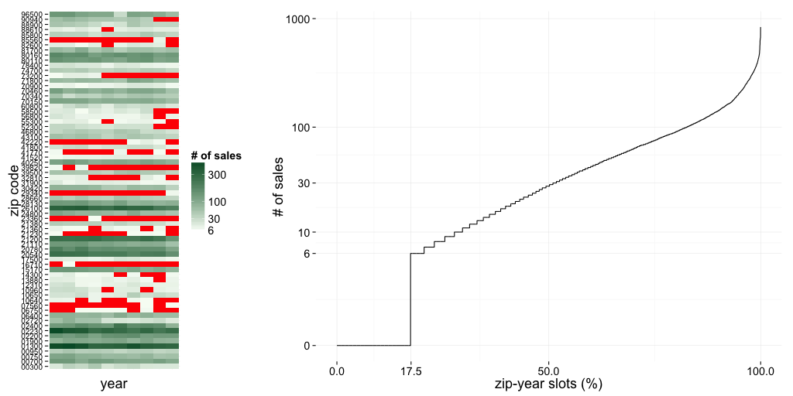
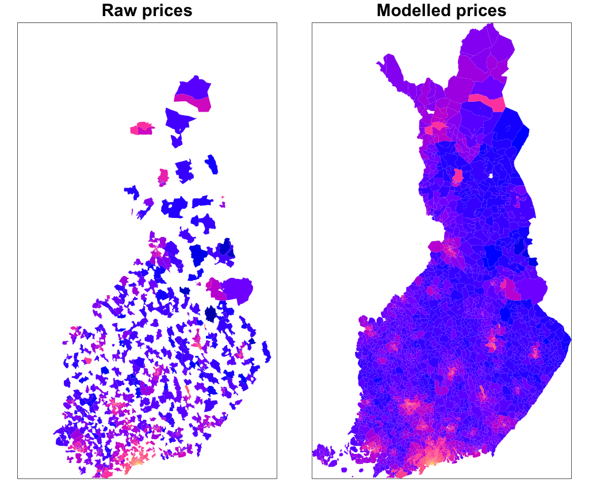
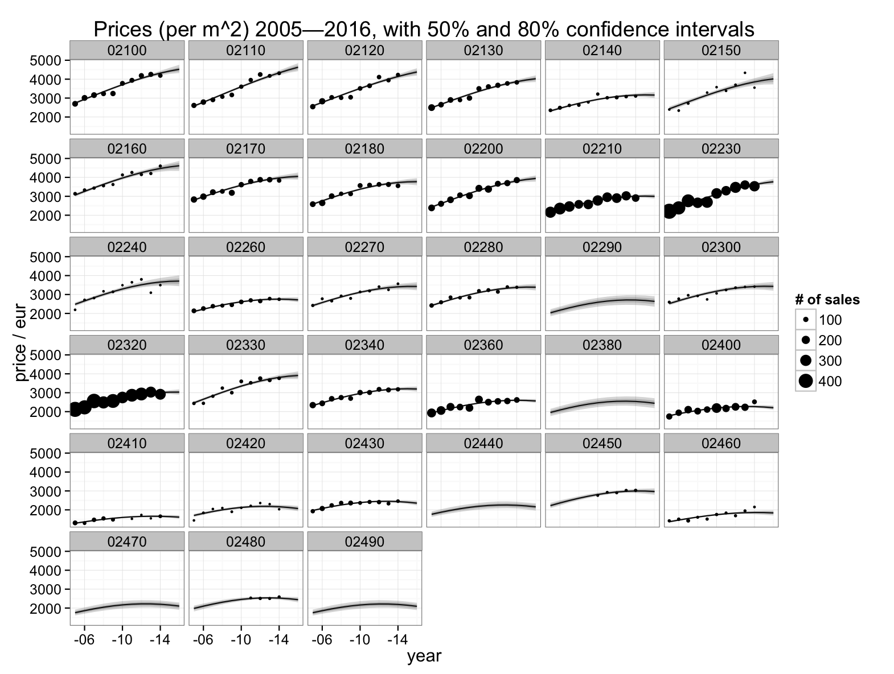

Basing on open data from [Statistics Finland](http://www.stat.fi/index_en.html), we at [Reaktor](http://reaktor.com/datascience) modelled Finnish apartment prices and their trends, on the zip-code level, during 2005--2014.  Estimates from the model are available as an [interactive visualization](http://kannattaakokauppa.fi/).

## Why model 

The original price data consists of local (geometric) mean sales prices per year. The number of sales is available as well. If there are less than six sales, the mean price is censored. 

Holes in the data and noise from low number of transactions make it hard to evaluate local price levels, let alone their changes, except at the most urban areas.  

Yearly numbers of transactions for a few random zip codes are depicted on the left below. Censored slots are with red. On the right, all year-zip slots are ordered on the x-axis by their available number of sales data. We see that 17.5% of slots are censored, and about half of the mean prices are either missing or based on less than 30 transactions. 

Price from 6--30 sales _is not a reliable estimate of the local mean_, and deriving trends from so few sales is not going to be successful. (Still, it is repeatedly tried: There have been several top and bottom lists of apartment prices and their development published in the Finnish media lately. They are based on this raw data.) 

A statistical model has a concept of a _price level behind individual sales_. 
It can then make a distinction between variation of the underlying price level, systematically over time and place, from _random_ variation that is not explainable within the model. This is in contrast to looking at raw data, where all variation is taken at face value. 

When the model is _estimated_, it produces the underlying price level as its output. Of course, because the model cannot explain all variation in data, the price level estimates will also have a random component: Instead of a fixed value, we get a probability distribution. Means, trends, confidence intervals, etc., can be computed from these distributions. Provided the model is sensible, these estimates of underlying price trends can be much more informative than the raw data. Uncertainty of the estimates also reveals when nothing can be said. 

Some properties of zip code areas, like population density, will correlate strongly with apartment prices. Such properties, if known and included in the model, and adjacency or  hierarchy of the zip code areas, allows us to _generalize_ spatially: estimates of price level become available even on places where the data is sparse or there is no data at all. Of course, uncertainty will then be higher, and the model will tell us that.

Below, the map on the left shows raw mean prices over the whole period 2005--2014. White areas are without any available data. Map on the right shows the (mean) price level estimates from a model. 

Below, yearly mean prices and estimates of the underlying price level are depicted for some zip codes at Espoo, part of the capital area of Finland. Shading around the lines indicate uncertainty of the estimates. Even within this relatively urban region, there are areas with few enough sales to introduce considerable random variation to the raw prices: 02150 or Otaniemi, 02240 or Friisilä, 02330 or Kattilalaakso, etc. Some areas have no sales at all, maybe even no apartments. 

The model can be used for forecasting, but future prices or trends will have large uncertainty, even larger than indicated by the model. The quadratic shape of the temporal dependency, currently in the model, was chosen to fir the data of the last decade, and give an idea of past price development that is easy to summarise. There is no reason why future changes in economy and policy would follow the same pattern.  Relative development of areas is more accurately predicted than absolute price levels or trends. Anyway, _the model is at its best at describing past development of apartment prices, especially their spatial differences. There is no guarantee future will follow the same pattern_. 

The model, data, and environment are described in more detail below.

## Environment

We used [R](http://www.r-project.org) for almost all data manipulation, modeling and visualizations. Model itself was estimated with [Stan](http://mc-stan.org). Source code for the project, except for the web site, is available in our [GitHub repo](https://github.com/reaktor/Neliohinnat).

## Data

The libraries [pxweb](http://cran.r-project.org/web/packages/pxweb/index.html) and [gisfin](https://github.com/ropengov/gisfin) make it easy to get [apartment prices](http://www.stat.fi/til/ashi/index.html) and other data from the public API's. The libraries are developed in the  [Louhos](http://louhos.github.io/) and [Ropengov](http://ropengov.github.io/) projects. Zip code areas are from [Duukkis](http://www.palomaki.info/apps/pnro/). Scripts used for downloading data and manipulating it are available in our [repo](https://github.com/reaktor/Neliohinnat).

## Map

Zip code polygons are available at least through the [Paavo API](http://www.stat.fi/tup/rajapintapalvelut/paavo.html) and from [Duukkis](http://www.palomaki.info/apps/pnro/). Finland's archipelago is extensive and complex, so zip codes extend well onto the Baltic sea.  Paavo offers two versions of the polygons, with or without the sea area. The zip code areas with sea can be intersected with the sea shore line, giving us quite beautiful Finnish zip code map. The problem is its size: over 20MB in the GeoJSON format. We ended up using the polygons from Duukkis: They are a good compromise between size and accuracy.

The set of zip codes was not constant over the data sources, so some zip codes areas may be missing from the visualizations. A few small areas have no population, or the information about population is missing. These polygons are without a price estimate, and appear as grey on the maps.  

Our model, described in more detail below, produces price and trend estimates even for areas with no apartments: just the relative position of the zip code and the local population density are enough for computing the estimate. 

## Model

Of the past sales, the model has yearly (geometric) average per location, and the associated number of sales, if these are not censored ($n<6$). The latter scales the variance of the mean, as an estimator of the population mean. Population mean is here the hypothetical mean of all potential *apartment sales* on the areas. Of course all apartments are not sold at the same rate, so mean is biased towards prices of the apartments that are sold more often. 

Sparseness of the data is a problem especially for estimates of temporal price changes, and also for comparison of areas. Properties of the zip code areas that would predict prices are therefore valuable. A quite extensive set of demographic variables is available in the [Paavo data](http://www.stat.fi/tup/rajapintapalvelut/paavo.html), but of these we have so far included only the population density in the model. Although not necessarily causal from the economics point of view, population density is the main demographic correlate of apartment prices. 

Spatial continuity of prices and trends also helps to estimate prices where data is sparse. As with demogrpahic covariates, no strict assumptions about dependency are coded into the model. Rather, including these auxiliary parts allows the model to use dependency where it exists. 

We ended up coding the spatial structure into a zip code prefix hierarchy. For example 02940 is within the Uusima district (0), city of Espoo (02), and northern Espoo (029). The hierarchy allows the model to see similarity within these and other equivalent nested areas. Real spatial continuity in the form of a Markov field or a latent gaussian field would be an alternative, but it would be much harder to estimate with the chosen tools, and would not be obviously better on modelling administrative areas that *are* nested, after all. 

Because temporal change of prices is as interesting as their overall level, informativeness of the results depends radically on how depedendency of the prices on the year is represented in the model. An option is to have a separate price level for each year, but continuity over time would then be lost and there would be no predictions. Also the relationship between price trends and covariates (population density), and between trends and spatial or hierarchical structure would be hard to define, for there would be no unique trend. These reasons and simplicity favor the current solution, a quadratic temporal parameterization. Combining hierarchy and covariates with a more flexible temporal model, like a gaussian process, is an interesting research question. 

That is, in the model each zip code has its own temporal trend, and a constant change of trend over time (the quadratic coefficient). In addition, population density influences these parameters, especially where there are only few sales or no sales available. 

In total, there are three parameters on the zip code level: price level, its trend, and change of trend, affecting log-scale prices. On the next geographic hierarchy level three other parameters appear: the influences of (logarithmic) population density on the above three temporal parameters. These six parameters appear also on upper hierarchy levels. On each hierarchy level, the model has multinormal priors for the sets of three or six parameters, and hyperpriors for the variance and covariance of the multinormal distribution. The covariances bind different parameters together, so that for example price level helps the estimation of price trend, or the influence of population density. 

In summary, the lowest level of the model for the log prices is
$$
\log h_{it} = 
       \beta_{i1} + \beta_{i2} t + \beta_{i3} t^2 + \beta_{i’4}d_i + \beta_{i’5}d_i\,t + \beta_{i’6}d_i\,t^2, 
$$
$$
\log y_{it} \sim 
\textrm{t}\,\left(\log h_{it}, \, \sqrt{\sigma^2_y + \frac{\sigma^2_w}{n_{it}}}, \, \nu\right)\,,
$$
where $i$ refers to the zip code area, $t$ is time, $\beta$ are coefficients specific to the zip code $i$, $i’$ is the first prefix hierarchy level of the zip code (population density parameters are constant within each $i’$-area), $t()$ is the t-distribution, $\sigma_y$ is standard deviation of the underlying (log) price levels over years, $\sigma_w$ standar deviation of the prices within the measurement unit (year$\times$zip), and $\nu$ the degrees of freedom of the residual t-distribution. Note that the linear model is for log-scale prices. The complete model is best described  by the [source code](https://github.com/reaktor/Neliohinnat/blob/master/source/m4.stan). 

Estimate for $\nu$ is around 6.5, that is, residuals are with a bit heavier tails than normal. From the covariance parameters (*Omega* in the source) one sees that price level and trend correlate at the lowest level ($r$=0,28), as well as trend change and price level ($r$=0,43). So price differences have been deepening during the last ten years, probably due to urbanisation, a global trend. 

Plotting area-wise prices and its changes against population density, one sees the expected correlation:

The model has been written and estimated with the probabilistic programming language Stan ([http://mc-stan.org/](http://mc-stan.org/)). Stan produces a Monte Carlo estimation algorithm from a generative model description.

## What is missing, and future steps

At least this chapter is missing. 
