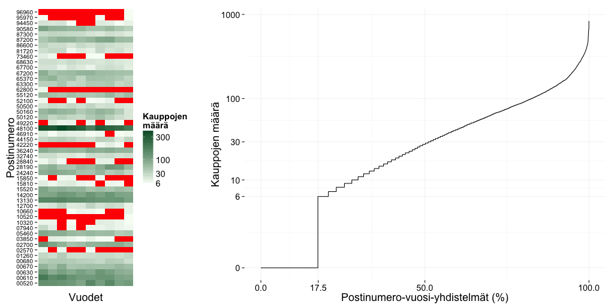
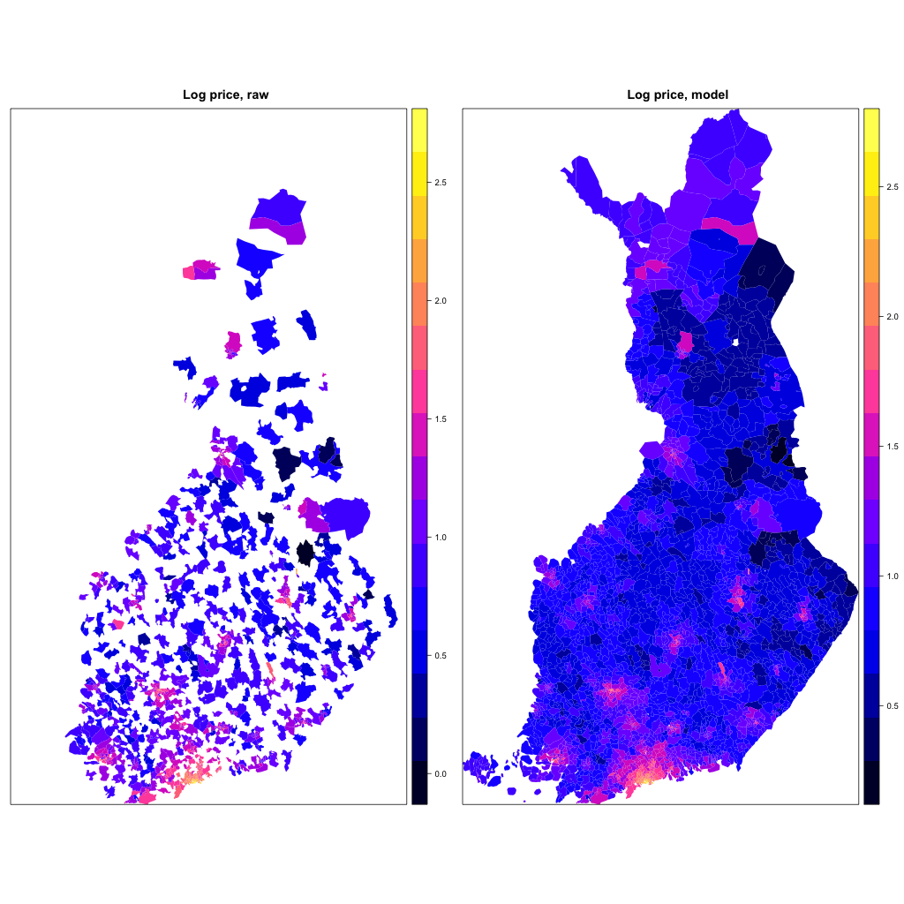
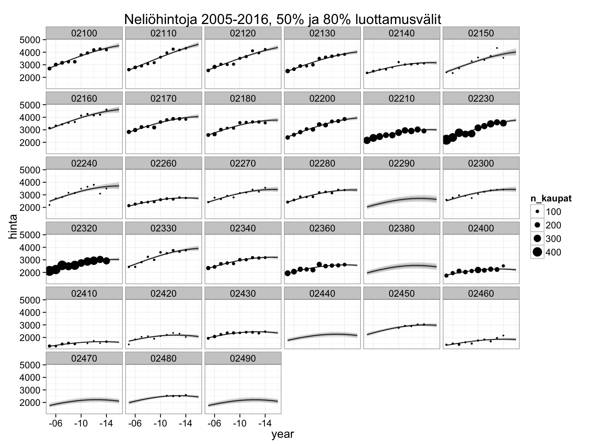
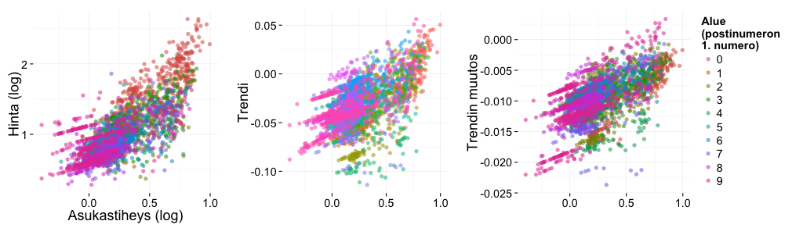

## WTF

Mallinsimme osakeasuntojen hintoja ja niiden muutoksia, postinumerotasolla, koko Suomessa, vuosina 2005–2014, perustuen Tilastokeskuksen jakamiin kauppa- ja asukasmäärätietoihin. Mallin arvioita hinnoista voi tarkastella interaktiivisesta karttavisualisoinnista (FIXME). Tuloksista on myöskin lisätietoa muissa blogeissa (FIXME).

## Mallinsimme?

Tilastokeskuksen avaamat asuntojen hintatiedot ovat keskiarvoja per postinumero ja vuosi. Jos kauppoja on alle kuusi, keskiarvokin on sensuroitu. Hinnan ohella ilmoitetaan kauppojen määrä. 

Raakadatasta on useimmille postinumeroille vaikea suoraan arvioida hintoja ja etenkin niiden muutoksia.

Alla on vasemmalla satunnaisten postinumeroiden vuosittaisia kauppamääriä. Sensuroidut tiedot on merkitty punaisella. Oikealla postinumero-vuosi-yhdistelmät on järjestetty kauppojen määrän mukaan. Kauppoja ei ole tehty tai tieto on sensuroitu siis n. 17,5% tapauksista, ja noin puolet keskihinnoista joko puuttuu tai on laskettu alle 30 kaupan perusteella. 

Puuttuva tieto on puuttuvaa, mutta edes 6--30 kaupan keskiarvo _ei kuvaa luotettavasti alueen kaikkien osakkeiden hintatasoa_. Myydyt asunnot ovat satunnaisesti keskihintaa kalliimpia ja halvempia. Vielä huonompaa jälkeä syntyy, kun näin vähistä kaupoista yritetään suoraan arvioida hintojen muutoksia. __Mediassa julkaistut listat parhaiten ja huonoiten menestyvistä alueista ovatkin lähes satunnaisia__, tiheimpiä taajamia lukuunottamatta. 

Hinnoista saa paremman kuvan, kun aineistoon sovittaa tilastollisen mallin. Tai jos ei saa, malli paljastaa lähtötietojen heikkouden --- hyvin tehdystä mallista saa epävarmuusarviot kiinnostaville asioille, kuten hintatasoille.

Malli voi myös ottaa huomioon alueellisen jatkuvuuden, ts. lähekkäisten postinumeroalueiden samankaltaisuuden. Se osaa painottaa trendi- ja keskihinta-arvioissa kauppojen määrän oikein, ja vielä paikata jäljelle jäävää epävarmuutta postinumeroalueen muilla ominaisuuksilla, kuten väestötiheydellä. 

Alla vasemmalla on kartta postinumeroiden keskihinnoista tarkastelujaksolla 2005--2014, logaritmisena huippuhintojen hajonnan vuoksi, oikeassa kuvassa samat logaritmiset hinnat mallista. Vasemman kartan valkoisille alueille ei keskihintaa saatu, koska kauppoja ei ollut lainkaan. 

Vielä alla näemme kuvan eräistä Espoon postinumeroalueista. Pisteet kuvaavat Tilastokeskuksen ilmoittamia vuosihintoja, pisteiden koko kauppojen määrää. Viivat ovat mallin arvioita hintatasosta, harmaat alueet arvion epävarmuuksia, mallin itsensä mielestä.

Hinta-arvioita on saatu vähistäkin kaupoista, ja etenkin vuosimuutokset ovat luotettavamman näköisiä kuin mitä melko paljon heittelevistä keskihinnoista suoraan laskien saisi. Hintojen mallintaminen siis kannattaa.

Mallista saa ennusteen lähivuosille, mutta ennusteen kanssa kannattaa olla varovainen. Talouden kehitystä ja muita hintoihin ratkaisevasti vaikuttavia seikkoja on mahdoton ennustaa tarkasti muutamaa kuukautta pidemmälle. _Malli on parhaimmillaan kuvattaessa lähimenneisyyden hintakehityksen pääpiirteitä, ei ennustettaessa tulevaisuutta._ 

Alla on yksityiskohtaisempaa tietoa datasta, mallista ja visualisoinnista. 

## Ympäristö

Mallinnus tehtiin [R-ympäristössä](http://www.r-project.org), itse malli [Stan-kirjastolla](http://mc-stan.org), ja kaikki lähdekoodi on saatavilla [GitHubista](https://github.com/reaktor/Neliohinnat).

## Data

[Asuntojen hintatiedot](http://www.stat.fi/til/ashi/index.html) saa Tilastokeskukselta kätevästi R:ään [Louhos](http://louhos.github.io/)- ja [Ropengov](http://ropengov.github.io/)-projektien kirjastoilla [pxweb](http://cran.r-project.org/web/packages/pxweb/index.html) (hinnat) ja [gisfin](https://github.com/ropengov/gisfin) (muut). Postinumeroalueiden karttapohja haettiin [Duukkikselta](http://www.palomaki.info/apps/pnro/). Skriptit datojen hakemiseen, käsittelyyn ja yhdistelyyn ovat [GitHub-repossa](https://github.com/reaktor/Neliohinnat).

## Karttavisualisointi

Karttapohjia postinumeroalueittaiselle aineistolle saa ainakin Tilastokeskuksen [Paavo-rajapinnasta](http://www.stat.fi/tup/rajapintapalvelut/paavo.html) ja [Duukkikselta](http://www.palomaki.info/apps/pnro/). Paavo tarjoaa kartasta kahta versiota. Merialueet sisältävä kartta ei sovi visualisointiin ilman erillistä rantaviivaa. Rantaviivaan rajattu näytti hyvältä, mutta tarkkuudesta maksettaisiin GeoJSON-objektin koolla: yli 20 megatavua. Päädyimme käyttämään Duukkiksen pohjaa, jossa karkea rantaviiva tuottaa meille hyvän kompromissin koon ja ulkonäön välillä. 

Pieniä eroja postinumeroissa oli, joten muutama alue on saattanut karttapohjan valinnan takia kadota. 

Malli tuottaa hinta-arvioita vaikkei postinumerossa olisi osakehuoneistoja, kaupoista puhumattakaan: pelkkä sijainti ja väestötiheys riittävät. Muutamilta pieniltä, teollisuus- ja sairaala-alueiden näköisiltä postinumeroilta puuttuu väestötietokin, ehkä koska niissä ei virallisesti asu ketään. Nämä pienet postinumeroalueet näkyvät kartassa harmaana ja ilman ennustetta. 

## Malli

Mallin asuntojen hinnoista pitää ottaa huomioon monta asiaa. Tärkein on tietenkin *toteutuneiden kauppojen hinnat* — joista tiedämme vain keskiarvon jos sitäkään. Tiedossa olevan kauppojen lukumäärä auttaa, koska keskinta kertoo tarkemmin hintatasosta kun kauppoja on enemmän.

Koska kauppatietoa on etenkin maalta vähän, on hyvä ottaa malliin *postinumeroiden ominaisuuksia*, jotka selittävät hintavaihtelua. Taajamissa asunnot ovat kalliimpia, joten asumistiheys on ilmeisen tärkeää. Postinumeroittainen asukastiheys ei ole sama asia kuin keskimääräinen asumistiheys, mutta korreloi siihen vahvasti.

Hintojen alueellinen vaihtelu tekee lähekkäisistä postinumeroista keskimäärin samankaltaisia. Tätä voi hyödyntää hinta-arvioissa: naapuripostinumeron kaupat kertovat ainakin karkealla tasolla omastakin alueesta, etenkin jos oman alueen kauppoja on vähän. Tietenkään emme voi tehdä riippuvuudesta vahvaa oletusta, mutta voimme antaa mallin havaita riippuvuuden ja käyttää sitä, jos riippuvuutta on.

Päädyimme mallissa koodaamaan alueiden lähekkäisyyden hierarkiaksi, joka saadaan suoraan numerosta: Esim. 02940 on Uusimaata (0), Espoota (02) ja Pohjois-Espoota (029). Hierarkia antaa mahdollisuuden mallille pitää näiden ja muiden vastaavien sisäkkäisten alueiden postinumeroita samanlaisina ympäristöön verrattuna, jos ne sitä ovat. (Spatiaalinen lähekkäisyys olisi vaihtoehto, mutta se on monella tapaa teknisesti hankalampi ja kadottaa mahdollisen äititaajaman vaikutuksen.)

Hinnoissa kiinnostavinta on tason jälkeen ajallinen muutos. Niinpä hintatason ja vuoden keskinäinen suhde mallissa on oleellinen sen luonteen ja informatiivisuuden kannalta. Vuosille voisi kullekin antaa omat hintatasonsa, mutta hintatason ajallinen muutos olisi vapaiden vuositasojen mallissa liiankin vapaasti määritelty, eikä ennustetta ensi vuodelle syntyisi. Ja koska hintatason muutokset ovat hintojen tapaan alueellisia ja voivat riippua esim. väestötiheydestä, päädyimme malliin, jossa hinnan ajallinen muutos eli trendi ja trendin muutos ovat eksplisiittisesti mukana. 

Vuoden vaikutus mallissa on siis kvadraattinen, ts. joka postinumerolla on mallissa oma trendinsä ja trendin muutosnopeus per vuosi. Lisäksi väestötiheys pääsee ennustamaan näitä muutoksia. Sen vaikutus näkyy etenkin jos kauppoja on vain vähän tai ei ollenkaan. 

Postinumerokohtaisia hintaparametreja kertyy yhteensä kuusi: hintataso, trendi, trendin muutos, ja väestötiheyden vaikutus näihin kaikkiin. Parametreilla on arvot ja varianssit myös postinumeroa isommille hierarkian alueille (Uusimaa, Espoo, jne.), josta ne pääsevät vaikuttamaan postinumerokohtaisiin arvioihin etenkin kun kauppoja on vähän. Parametreilla on myös eri hierarkiatasoilla kovarianssit, jolloin ne voivat auttaa toistensa estimointia tapauksissa joissa hintadata ei suoraan riitä. 

Yhteenvetona kaavaksi, mallin alataso havaitulle keskihinnalle $y$ on 

$$
\log h_{it} = 
       \beta_{i1} + \beta_{i2} t + \beta_{i3} t^2 + \beta_{i’4}d_i + \beta_{i’5}d_i\,t + \beta_{i’6}d_i\,t^2, 
$$
$$
\log y_{it} \sim 
\textrm{t}\,\left(\log h_{it}, \, \sqrt{\sigma^2_y + \frac{\sigma^2_w}{n_{it}}}, \, \nu\right)\,,
$$
jossa $i$ on postinumeroalue, $t$ vuosi, $\beta$ ovat postinumerokohtaisia hintakertoimia, $i’$ on postinumeron alin hierarkiataso (väestötiheysparametrit ovat yhteisiä kullekin $i’$-alueelle), $t()$ on t-jakauma, $\sigma_y$ vuosikohtainen hajonta, $\sigma_w$ kauppahintojen hajonta mittausyksikön (vuosi$\times$postinumero) sisällä, ja $\nu$ t-jakautuneen residuaalin vapausaste. Hinnat käsitellään mallissa logaritmisena, jolloin absoluuttisella hintaskaalalla malli on multiplikatiivinen. Hajonnat ja $\nu$ estimoidaan kaiken muun ohella. Kertoimille $\beta$ on multinormaali priori kovarianssimatriiseineen, ja lisäksi ylemmille hierarkiatasoille eli postinumeroa suuremmille alueille omat vastaavat rakenteensa ($\beta$ ja sen priorit). Yksityiskohdat tätä tarkemmin selviävät parhaiten [mallikoodista](https://github.com/reaktor/Neliohinnat/blob/master/source/m4.stan). 

Vapausasteen $\nu$ estimaatti on luokkaa 6,5, eli hintojen residuaali on normaalijakaumaa selvästi pitkähäntäisempi. Suoraan mallin parametreista (koodissa matriisi "Omega") nähdään, että hintataso ja trendi korreloivat yli postinumeroalueiden ($r$=0,28), samoin trendin muutos ja hintataso ($r$=0,43). Halvat alueet ovat siis viimeisen n. kymmenen vuoden aikana halventuneet edelleen, ja kalliit kallistuneet. Tämä liittynee asutuksen keskittymiseen. 

Postinumerokohtaisista estimaateista nähdään, että asukastiheys korreloi niin hintatasoon kuin sen muutoksiinkin:

Malli on estimoitu Stan-kirjastolla ([http://mc-stan.org/](http://mc-stan.org/)). Stan on [todennäköisyysohjelmointikieli](https://louhos.wordpress.com/2014/01/29/stan-kj/), joka tuottaa generatiivisesta mallin kuvauksesta estimointialgoritmin. Vaihtoehdoista estimoinnin itse koodaaminen olisi huomattavan työlästä, kun taas valmiiden mallipakettien (lme4, mgcv, …) käyttäminen pakottaisi tyytymään rajoittuneempaan malliin, joka kuvaisi asuntojen hintoja ja niiden vaihtelua huonommin. 

