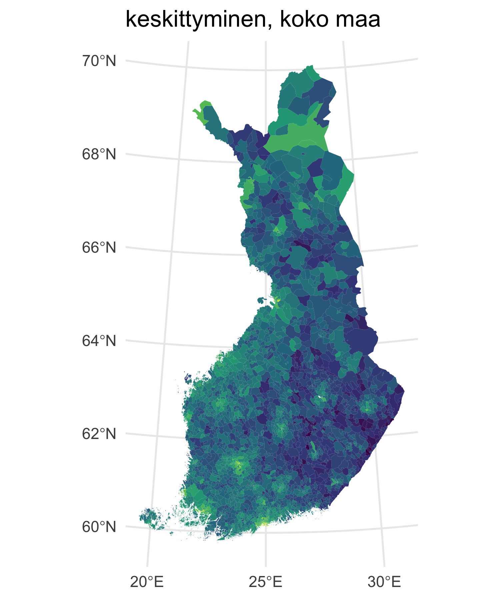
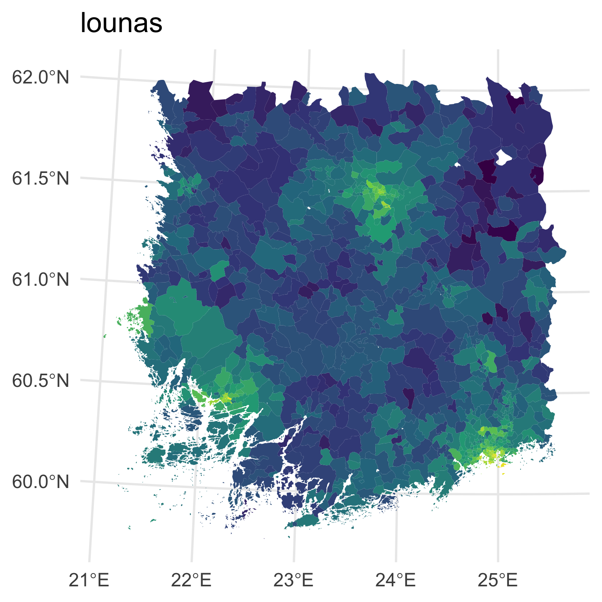
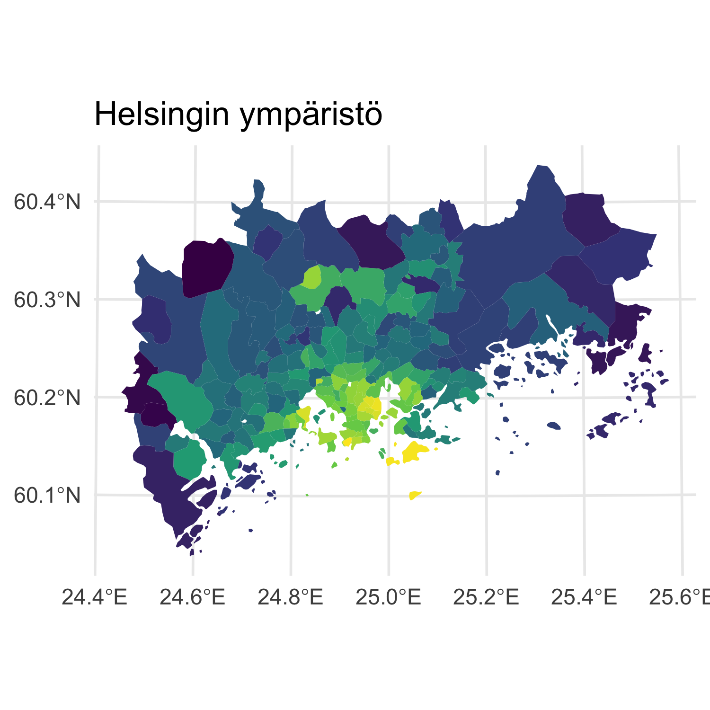
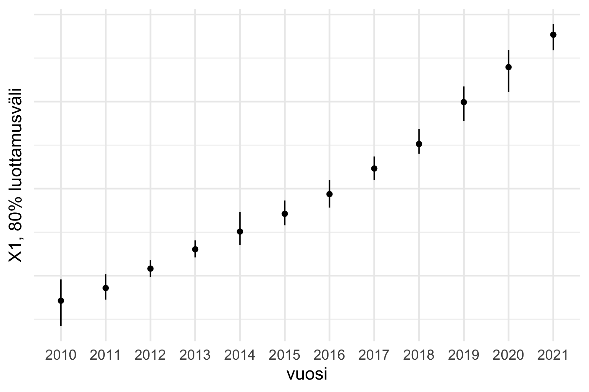
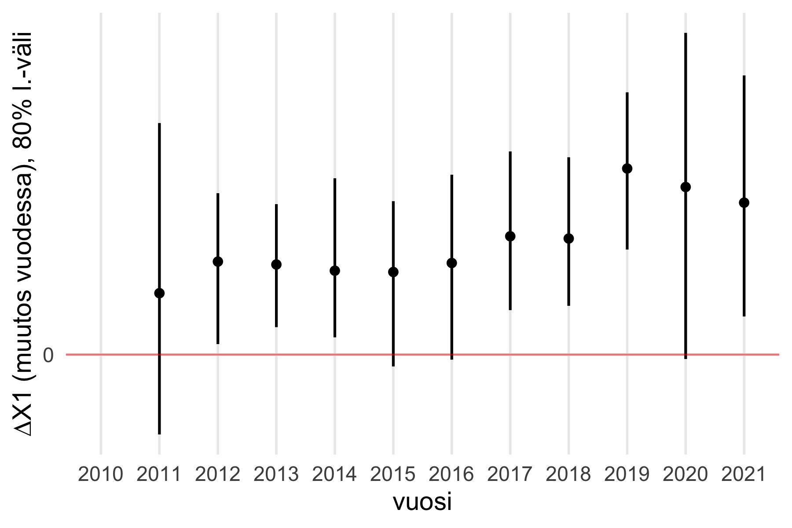
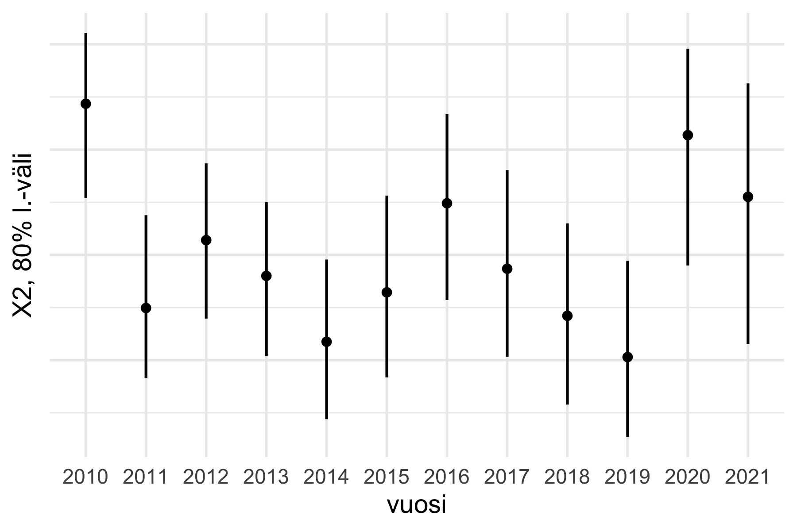
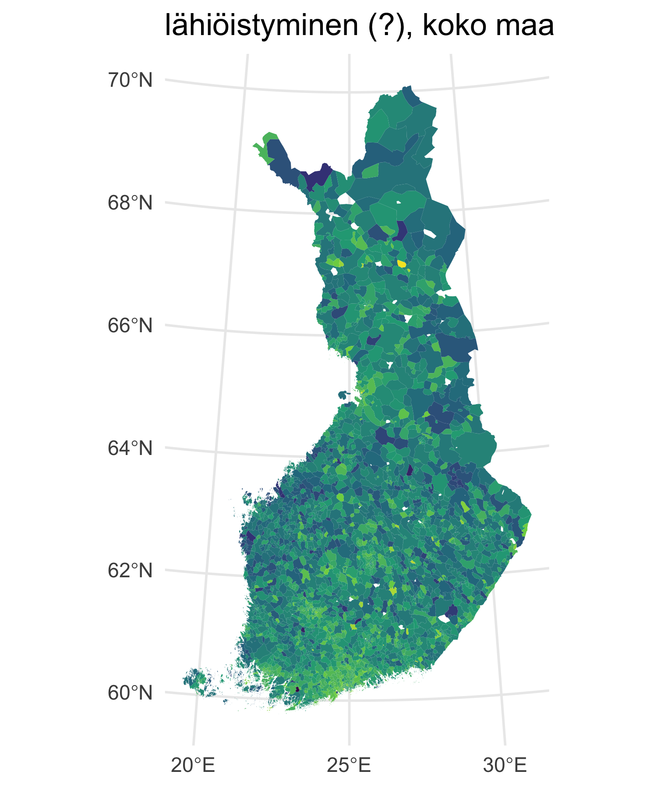
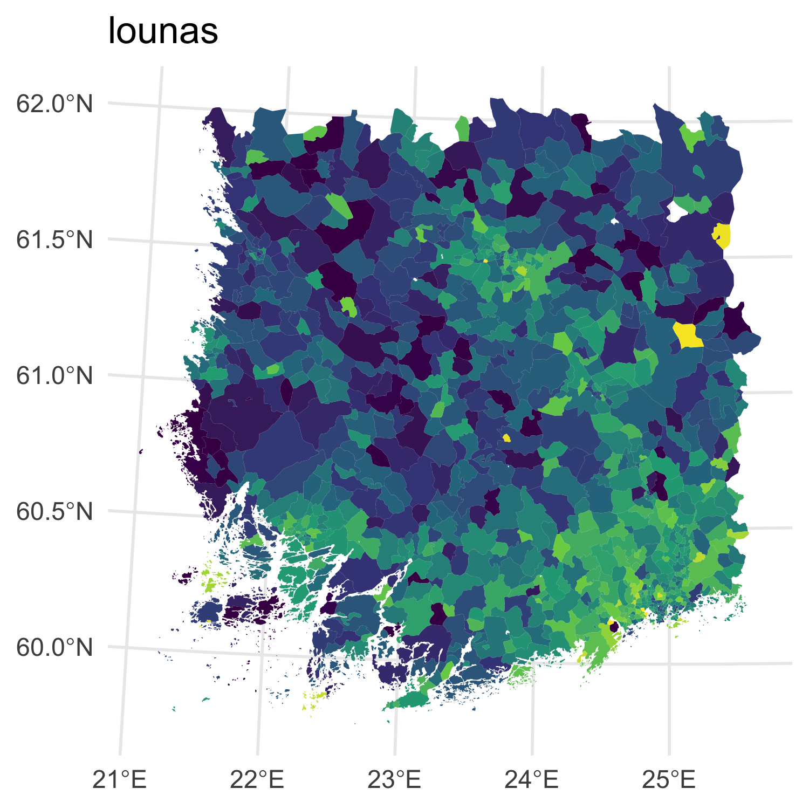
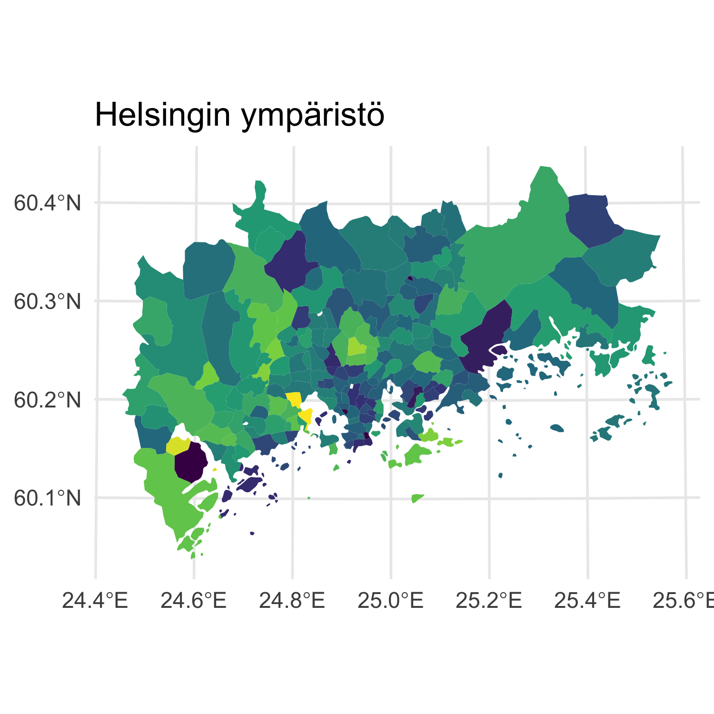
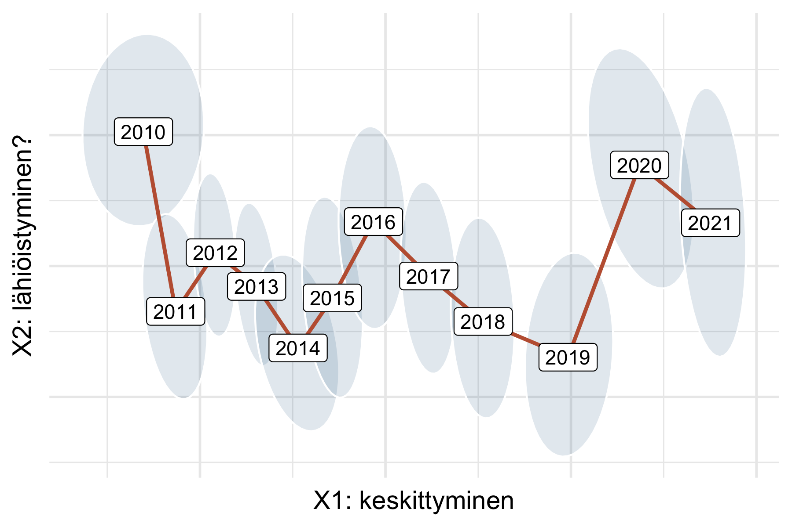

---
output:
  pdf_document: default
  html_document: default
---
# Asuntojen hinnoista, taas

Reaktorin Kannattaako Kauppa julkaistiin ensimmäisen kerran keväällä 2015. Viime vuonna sen tilastollistan mallia päivitettiin ensimmäistä kertaa merkittävästi. Uusi malli on herkempi vuosikohtaisille muutoksille, ja siellä missä kauppoja on riittävästi malli hyväksyy kauppojen keskihinnan sellaisenaan. Mallin ennusteet siis tarjoavat aukkojen ja epävarmuuksien osalta täydennetyn, koko maan ja kaikki vuodet kattavan arvion asuntojen hinnoista, postinumerotasolla. 

Kun hintoja on kokonaiselta vuosikymmeneltä, tekee mieli hahmotella kokonaiskuvaa. Keskittyminenkö aina vain jatkuu? Vaikuttiko korona, ja jos vaikutti, menikö vaikutus jo ohi? Mitä muuta tapahtuu?

Niille jotka eivät jaksa lukea, voi paljastaa tärkeimmät nyt, eli:

* Tiivistyminen jatkuu ja on jopa kiihtynyt. Erityisesti Itä-Suomi näyttää kartoissa kovin tummalta. 
* N. 15% hinnanvaihtelusta menee kuitenkin toiseen piikkiin, jota voisi kutsua lähiöistymiseksi ja järvisuomettumiseksi. Korona lisäsi tätä, eikä vaikutus näytä vielä kadonneen. 
* Energian hinnan ja korkotason nousun vaikutukset eivät näkyne vielä. Palataan näihin ensi vuonna. 

Takaisin asiaan... mallista siis meillä on taulukko (tai kuten sanotaan, matriisi) hintoja vuosille 2010--2021, kaikille postinumeroille. Tai koska emme oikeasti tiedä todellisia hintoja kauppojen äärellisen määrän takia, meillä on näitä taulukoita satoja, kukin edustaa yhtä mahdollista maailmaa asuntojen hintojen osalta. 

Teimme hintataulukoille ns. pääkomponenttianalyysin, jossa selitämme hinnanmuutoksia muutamalla, lopulta vain parilla hahmolla eli "komponentilla" vuosien ja postinumeroiden yli. (Teknisemmille lukijoille: tämä siis jokaiselle posteriorinäytteelle erikseen, ja ennen SVD:tä poistettiin vuosi- ja postinumerokeskiarvot.) Menetelmän etu on, että emme oleta trendejä tai urbanisaatiota, vaan aika pitkälti se mitä näkyy tulee suoraan datasta. 

Ja todellakin, ensimmäinen löytyvä hahmo on keskittyminen: hinnat nousevat kaupungeissa, eniten keskustoissa, ja laskevat maaseudulla, etenkin Itä-Suomessa.

{width=32%}
{width=32%}
{width=32%}

Kehitys on lisäksi vuosien osalta monotonista, ja jopa nopeutunut parina kolmena viimeisenä vuotena.

{width=49%}
{width=49%}

Keskittyminen selittää n. 75% hintojen vaihtelusta. Toiseksi vahvin komponentti selittää n. 15%, ja lopuista on hankalampi ottaa selvää. 

Toinen komponentti on vuosinäkymältään mielenkiintoinen:

{width=49%}

Se oli korkealla aikasarjan alussa, v. 2010, ja koronavuosina 2020--2021, sekä mahdollisesti myös v. 2016. Kun tätä komponenttia katsoo kartoilla, voi todeta sen vastaavan hintojen nousua lähiöissä keskustojen ulkopuolella, sekä mahdollisesti Järvi-Suomessa. 

{width=32%}
{width=32%}
{width=32%}

Lähiöistymiskomponentin vaikutus on kuitenkin keskittymiskehitykseen verrattuna niin pieni, että laskuun se ei ole hintoja vielä ainakaan pääkaupunkiseudulla kääntänyt. 

Kun lähiöistymiskehitys laitetaan y-akselille ja keskittymiskehitys x-akselille ja plotataan kuvaan vuodet epävarmuuksineen, saadaan aikaan tällainen yhteenveto kymmenen vuoden hintakehityksestä:

{width=60%}

Lähiöistymisen syitä on vaikea tietää, ja sen voimakkuuskin on epävarmaa. Se sopii kuitenkin tarinaan koronan aiheuttamasta etätöiden lisääntymisestä ja kaipuusta väljempiin asuinolosuhteisiin. Toinen näkökulma samaan asiaan voi olla viime aikoina uutisoitu pienten asuntojen hinnanlasku; pieniä asuntojahan on enemmän keskustoissa. 

Alkuvuodesta Ukrainan sodan tarjontavaikutukset etenkin energian osalta, jatoisaalta pinnalle palaava finanssipolitiikka muuttavat asuntomarkkinoita. Näihin palaamme ensi keväänä. 

